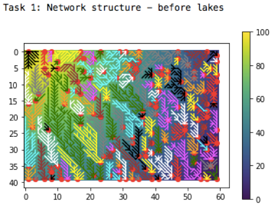
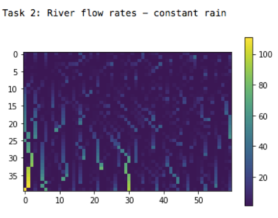
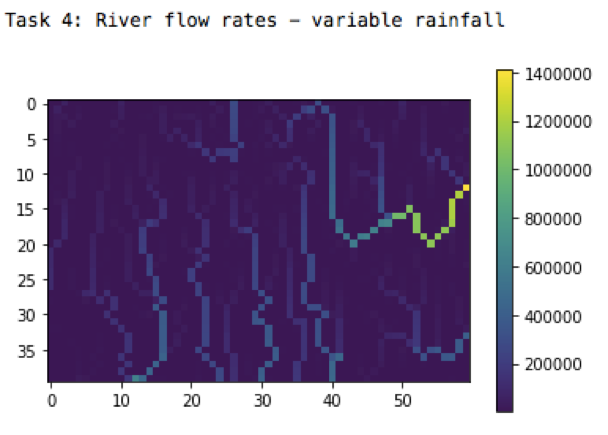
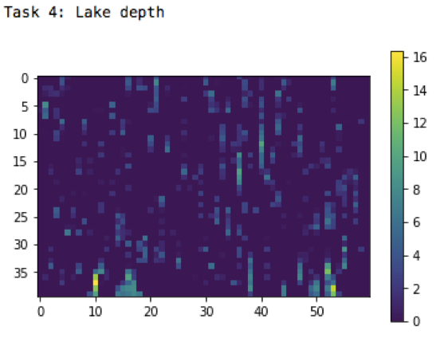
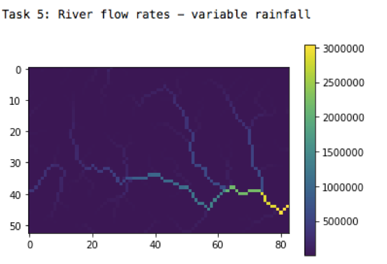

# 
🌊Hydrological Flow Model

## 
✅

Implementation of the D8 algorithm, a lake identification and flow algorithm with python and matplotlib.

This code implements a flow algorithm using a DEM and rainfall data. It further identifies and fills pitflags / lakes and develops a drainage algorithm using a gravitation model towards the lake outflow. For more information and pseudo-code of the drainage algorithm see: [www.geo-blog.com/lake-flow-algorithm](http://www.geo-blog.com/lake-flow-algorithm/)

The code is split into four different tasks (see comments in Driver.py).

## TASK 1

The output diagram "Network structure - before lakes" displays a flow network structure before removing pitflags (the networks are not connected).

The background in this figure represents the elevation, with yellow colours representing higher raster cells and blue colours indicating low raster cells. The lines represent the flow direction. The flow direction is calculated with the standard algorithm D8, introduced by O’Callaghan & Mark (1984), which looks at the 8 neighbour cells and sets the flow direction to the lowest neighbour (see also setDownnode() method of FlowRaster class in Flow.py). Furthermore, when no neighbouring cell is lower than the cell itself it is marked with a red point in Figure 1, representing a “pitflag”. Pitflags are raster cells that don’t have a downnode, i.e. the water can’t flow in any other cell from this cell.

## TASK 2

Task 2 calculates flow rates (assuming constant rainfall) using the network structure from task 1. The flow rates are calculated in the recursive function *getFlow()*. Note that water seems to disappear in a lake / pitflag because the networks are not joined yet.

This figure shows the river flow rates with constant rain (1mm per cell). Yellow values indicate a high flow rate while blue values indicate a low flow rate.

## TASK 3

Task 3 repeats task 2 using non-constant rainfall (randomly generated)

## TASK 4

Task 4 makes the hydrological model more realistic by joining the catchment areas. To do this, sinks and lakes are identified and outflows of the lakes are calculated.
This was carried out in three steps. First, lakes are identified by an algorithm starting with each pitflag and creating a path to an edge with always choosing the lowest neighbour (similar to the D8 algorithm). The highest point of this path represents the outflow of the lake. In a second step, the identified lakes are filled up to the same height as the outflow. Third, a new flow with gravitation towards the lake outflow is calculated for each lake.

To test the implemented algorithm the incoming rainfall and the summed flow at pitflags on an edge were compared. The two values had to be the same.

Algorithm for calculating flow with gravitation towards the lake outflow.

## TASK 5

For task 5 real raster data (rainfall and DEM) is imported and converted to the same resolution.

